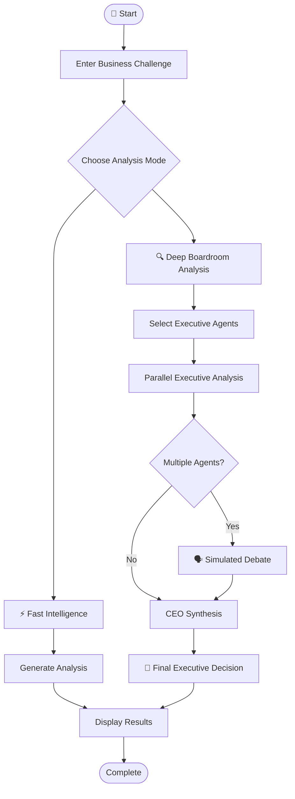
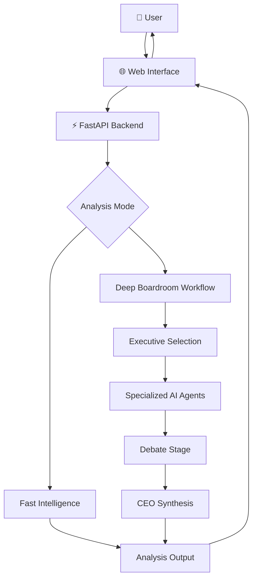

<div align="center">

# 🏛️ AI BOARDROOM OS
### Multi-Agent AI Business Decision Simulator

**One business challenge. Multiple AI executives. One strategic decision.**

An AI-powered boardroom where specialized agents analyze business problems, debate strategic options, and synthesize their insights into a unified executive recommendation.

<br/>

[](https://ai-boardroom-xexp.onrender.com)
[](https://github.com/krushnakodgirwar/AI-Boardroom)

<br/>


</div>

---

## 🌐 Experience the Boardroom

> **Think like a CEO. Analyze like an executive team. Decide with AI-assisted insights.**

🔗 **Live Application:** https://ai-boardroom-xexp.onrender.com

📂 **Source Code:** https://github.com/krushnakodgirwar/AI-Boardroom

---

## 📌 Table of Contents

- [Overview](#-overview)
- [Why AI Boardroom OS?](#-why-ai-boardroom-os)
- [Key Features](#-key-features)
- [Meet the AI Executives](#-meet-the-ai-executives)
- [How It Works](#-how-it-works)
- [System Architecture](#-system-architecture)
- [Technology Stack](#-technology-stack)
- [Getting Started](#-getting-started)
- [API Reference](#-api-reference)
- [Deployment](#-deployment)
- [Example Use Case](#-example-use-case)
- [Limitations](#-limitations)
- [Future Enhancements](#-future-enhancements)
- [Author](#-author)

---

## 🧠 Overview

**AI Boardroom OS** is a multi-agent business decision simulator designed to explore how AI agents with different executive responsibilities can collaborate on complex business problems.

Instead of relying on a single AI response, the system brings together specialized executive perspectives.

Each selected agent examines the problem through its own business lens. Their insights can then be combined through a structured analysis and executive decision workflow.

### 🎯 The Core Idea

| Traditional AI Chat | AI Boardroom OS |
|---|---|
| One AI perspective | Multiple executive perspectives |
| Single response | Structured analysis workflow |
| Limited role separation | Specialized executive agents |
| Direct answer | CEO-style synthesis |

---

## 💡 Why AI Boardroom OS?

Business decisions often involve competing priorities.

A marketing strategy may increase customer acquisition costs. A financial decision may affect product development. A rapid expansion plan may introduce operational and legal risks.

**AI Boardroom OS explores these trade-offs through a simulated executive team.**

The project demonstrates how multi-agent AI systems can organize specialized analysis, compare perspectives, and produce a consolidated decision.

---

## ✨ Key Features

### 🤖 Multi-Agent Intelligence
Bring together AI executives with different responsibilities to analyze a shared business challenge.

### ⚡ Fast Intelligence
A streamlined analysis mode for users who want a quicker response.

### 🔍 Deep Boardroom Analysis
A more structured workflow involving executive analysis, discussion, and CEO synthesis.

### 🎛️ Flexible Agent Selection
Choose specific executive agents manually or use automatic agent selection, depending on the available interface options.

### 🗣️ Multi-Agent Discussion
Support a simulated debate stage where participating agents can contribute different perspectives.

### 👔 CEO Decision Synthesis
A CEO-style final stage consolidates the analysis into a unified strategic response.

### 🖥️ Interactive Web Interface
A browser-based experience for submitting business challenges and interacting with the boardroom workflow.

---

## 👔 Meet the AI Executives

The boardroom is organized around specialized executive roles.

| Executive | Focus Area |
|---|---|
| 👔 CEO | Final synthesis and strategic direction |
| 💰 CFO | Finance, budgets, costs, and profitability |
| 💻 CTO | Technology, architecture, and innovation |
| 📈 CMO | Marketing, branding, and customer acquisition |
| ⚙️ COO | Operations, execution, and efficiency |
| 🎯 CSO | Business strategy and growth |
| 🧪 CPO | Product development and product strategy |
| ⚖️ Legal | Legal considerations and compliance |
| 🛡️ Risk Officer | Risk identification and mitigation |
| 👥 CHRO | People, hiring, and organizational strategy |
| 📊 CRO | Revenue generation and commercial growth |

*Agent availability and behavior depend on the current application implementation.*

---

## 🔄 How It Works

The system follows a structured decision-making workflow.



### Workflow Breakdown

**01 — Submit a Challenge**

Enter a business problem, strategic question, or decision scenario.

**02 — Choose an Analysis Mode**

Select Fast Intelligence or Deep Boardroom Analysis.

**03 — Select Executive Agents**

Use the available agent-selection controls to configure the boardroom.

**04 — Analyze the Problem**

Selected agents examine the challenge from their respective business perspectives.

**05 — Discuss Strategic Trade-offs**

In the deep workflow, participating agents can enter a simulated debate stage.

**06 — Synthesize the Decision**

The CEO stage consolidates the available insights into a final response.

**07 — Review the Output**

Review the generated analysis and use it as an input to further human evaluation.

---

## 🏗️ System Architecture

The application separates the user-facing interface from the backend analysis workflow.



### Architecture Components

| Component | Responsibility |
|---|---|
| Frontend | User interaction and result presentation |
| FastAPI | Backend application and API endpoints |
| Agent workflow | Coordinates executive analysis |
| Language model | Generates AI analysis and responses |
| CEO synthesis | Consolidates agent insights |
| Deployment platform | Hosts the public application |

---

## 🛠️ Technology Stack

### Backend & AI

- **Python** — Core application language
- **FastAPI** — Backend API framework
- **PyTorch** — Deep learning framework
- **Qwen2.5-3B-Instruct** — Language model used in the local model workflow
- **4-bit NF4 quantization** — Model quantization configuration
- **Sentence Transformers** — Text embedding workflow
- **ChromaDB** — Vector database component

### Deployment & Development

- **Render** — Public application deployment
- **Cloudflare Tunnel** — Temporary public access to a local server during development
- **Uvicorn** — ASGI server
- **GitHub** — Source code and version control

---

## 🚀 Getting Started

Run the backend locally to explore the application.

### Prerequisites

- Python installed
- Git installed
- Project dependencies available
- Model access and sufficient hardware resources for the configured local inference workflow

### 1. Clone the Repository

```bash
git clone https://github.com/krushnakodgirwar/AI-Boardroom.git
```

### 2. Navigate to the Project

```bash
cd AI-Boardroom
```

### 3. Create a Virtual Environment

**Windows**

```bash
python -m venv venv
venv\Scripts\activate
```

**macOS / Linux**

```bash
python3 -m venv venv
source venv/bin/activate
```

### 4. Install Dependencies

If the repository contains a `requirements.txt` file:

```bash
pip install -r requirements.txt
```

### 5. Start the Backend

```bash
python -m uvicorn backend.app.main:app --host 0.0.0.0 --port 8000
```

### 6. Open the API Documentation

Visit:

http://localhost:8000/docs

The interactive FastAPI documentation can help you inspect the available endpoints.

---

## 🔌 API Reference

The following routes are part of the project's described backend interface. Confirm their current implementation and request schemas in the source code or `/docs`.

| Endpoint | Purpose |
|---|---|
| `/` | Root endpoint |
| `/health` | Health check |
| `/boardroom/analyze` | Boardroom analysis workflow |
| `/docs` | Interactive API documentation |

### Example Request

The precise request fields depend on the current API schema.

```http
POST /boardroom/analyze
Content-Type: application/json
```

Use the interactive documentation to inspect the required JSON body and available parameters.

---

## ☁️ Deployment

### 🌐 Public Application

The project is deployed on Render.

**Live URL:** https://ai-boardroom-xexp.onrender.com

### ☁️ Why Cloudflare Tunnel?

Cloudflare Tunnel can expose a locally running backend through a temporary public URL.

This can be useful when testing a frontend hosted elsewhere that needs to communicate with a backend running on your own machine.

Example:

```bash
cloudflared tunnel --url http://localhost:8000
```

The command can generate a temporary `trycloudflare.com` URL.

**Important:** A quick tunnel URL is temporary. It is not the same as a permanently deployed backend. Keep the local server running while using the tunnel.

---

## 🧪 Example Use Case

### Scenario: Should a startup expand into a new market?

**Business challenge:**

> A growing startup is considering expansion into a new market. Analyze the financial, technical, operational, and marketing implications, and propose a strategic approach.

### How the Boardroom Could Approach It

| Executive | Example analysis focus |
|---|---|
| CFO | Budget, costs, and financial exposure |
| CTO | Technical readiness and infrastructure |
| CMO | Customer demand and market positioning |
| COO | Operational capacity and execution |
| Risk Officer | Potential risks and mitigation |
| CEO | Consolidated strategic recommendation |

The generated response is an AI-assisted analysis, not a substitute for independent business research or professional advice.


---

## 🔮 Future Enhancements

Potential directions for further development:

- 📊 Interactive financial and business dashboards
- 🧠 Improved agent memory and context sharing
- 🔄 More advanced agent coordination
- 📚 Retrieval-augmented generation with business knowledge
- 📈 Quantitative scenario comparison
- 📄 Exportable boardroom reports
- 🔐 User accounts and saved analysis sessions
- 🧪 Automated evaluation of agent responses
- 🌍 Scalable inference and deployment architecture

---

## 👨‍💻 Author

<div align="center">

### Krushna Kodgirwar

B.Tech Computer Science Engineering  
Vishwakarma Institute of Technology, Pune

<br/>

[](https://github.com/krushnakodgirwar)

[](https://github.com/krushnakodgirwar/AI-Boardroom)

</div>

---

<div align="center">

### 🏛️ AI BOARDROOM OS

**Multiple perspectives. Structured analysis. Human-led decisions.**

[🚀 Open Live Demo](https://ai-boardroom-xexp.onrender.com) · [💻 Explore Source Code](https://github.com/krushnakodgirwar/AI-Boardroom)

</div>
