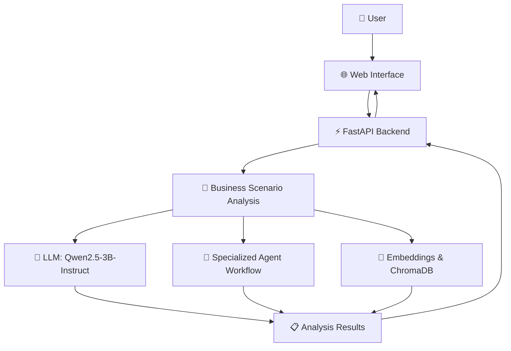

# 🏛️ AI Boardroom OS
### Multi-Agent AI Business Decision Simulator

<p align="center">
  <strong>Where AI executives collaborate to analyze business challenges and explore strategic decisions.</strong>
</p>

<p align="center">
  <a href="https://ai-boardroom-xexp.onrender.com">
    
  </a>
  <a href="https://github.com/krushnakodgirwar/AI-Boardroom">
    
  </a>
</p>

<p align="center">
  
  
  
  
  
</p>

---

## 🌐 Live Application

<p align="center">
  <a href="https://ai-boardroom-xexp.onrender.com">
    
  </a>
</p>

🔗 **Live URL:** https://ai-boardroom-xexp.onrender.com

> The frontend is deployed on Render. Full AI functionality depends on the backend being available and correctly connected.

---

## 📌 Table of Contents

- [✨ Overview](#-overview)
- [🎯 Project Goals](#-project-goals)
- [🚀 Features](#-features)
- [🧠 AI Architecture](#-ai-architecture)
- [🛠️ Technology Stack](#️-technology-stack)
- [📂 Project Structure](#-project-structure)
- [⚙️ Installation](#️-installation)
- [▶️ Running the Application](#️-running-the-application)
- [☁️ Deployment](#️-deployment)
- [🔌 API](#-api)
- [🔮 Future Enhancements](#-future-enhancements)
- [👨‍💻 Author](#-author)

---

## ✨ Overview

**AI Boardroom OS** is a multi-agent business decision simulator designed to explore how AI agents can contribute different perspectives to business problems.

The system brings together AI-powered executive roles to analyze a business scenario, discuss strategic considerations, and help users explore possible decisions.

Instead of relying on a single AI response, the project explores a boardroom-style workflow in which multiple specialized perspectives can contribute to the analysis.

### 💡 The Core Idea

> One business challenge. Multiple AI perspectives. A structured decision-making experience.

---

## 🎯 Project Goals

| Goal | Description |
|---|---|
| 🧠 Multi-agent reasoning | Explore business problems through multiple AI roles |
| 📊 Strategic analysis | Organize insights around business decisions |
| 🏛️ Boardroom experience | Present AI interactions through an executive-style interface |
| ⚡ Interactive workflow | Let users engage with the decision simulator |
| 🔍 Explainability | Make the reasoning and perspectives easier to inspect |

---

## 🚀 Features

### 🤖 AI-Powered Business Analysis
Use an LLM-powered backend to process business scenarios and generate analysis.

### 👥 Multi-Agent Concept
Explore different executive perspectives instead of depending entirely on one general-purpose response.

### 🎛️ Interactive Dashboard
A dedicated interface for engaging with the AI Boardroom experience.

### 🧠 Local Model Support
The backend has been configured to use **Qwen2.5-3B-Instruct**, with 4-bit NF4 quantization in the development environment.

### 🔎 Retrieval Support
The backend initializes an embedding model and ChromaDB for retrieval-related functionality.

### 🌐 Web-Based Access
The frontend is deployed on Render, making the interface accessible through a public URL.

---

## 🧠 AI Architecture



<details>
<summary><strong>🔍 How the workflow operates</strong></summary>

1. The user opens the web application.
2. The user submits a business scenario through the interface.
3. The frontend sends a request to the backend.
4. The backend processes the request using its configured analysis and AI components.
5. The system returns the generated result to the frontend.
6. The user reviews the output.

The exact agent orchestration and retrieval behavior depend on the implementation connected to the backend routes.

</details>

---

## 🛠️ Technology Stack

| Component | Technology |
|---|---|
| 🖥️ Frontend | HTML, CSS, JavaScript |
| ⚡ Backend | Python, FastAPI |
| 🤖 Language model | Qwen2.5-3B-Instruct |
| 🧮 Model quantization | 4-bit NF4 configuration |
| 🔎 Embeddings | all-MiniLM-L6-v2 |
| 🗃️ Vector database | ChromaDB |
| 🚀 ASGI server | Uvicorn |
| ☁️ Frontend hosting | Render |
| 🔗 Development tunnel | Cloudflare Tunnel |

---

## 📂 Project Structure

```text
AI-Boardroom/
│
├── frontend/
│   ├── index.html
│   ├── boardroom.html
│   └── ...
│
├── backend/
│   └── app/
│       ├── main.py
│       ├── api/
│       │   └── routes.py
│       └── ...
│
├── requirements.txt
├── .gitignore
└── README.md
```

> This is a high-level representation. Update the tree to match the exact files in your repository.

---

## ⚙️ Installation

### 1️⃣ Clone the repository

```bash
git clone https://github.com/krushnakodgirwar/AI-Boardroom.git
```

### 2️⃣ Navigate to the project

```bash
cd AI-Boardroom
```

### 3️⃣ Create a virtual environment

**Windows**

```bash
python -m venv venv
venv\Scripts\activate
```

**macOS / Linux**

```bash
python3 -m venv venv
source venv/bin/activate
```

### 4️⃣ Install dependencies

```bash
pip install -r requirements.txt
```

> ⚠️ PyTorch, CUDA, and GPU compatibility depend on your Python version and hardware. Use compatible dependency versions for your environment.

---

## ▶️ Running the Application

### 🖥️ Start the backend

From the project root:

```bash
python -m uvicorn backend.app.main:app --host 0.0.0.0 --port 8000
```

The backend should be available at:

- API: http://localhost:8000
- Health endpoint: http://localhost:8000/health
- Interactive API documentation: http://localhost:8000/docs

### 🌐 Open the frontend

Open the frontend entry page in your browser, or use the deployed version:

👉 https://ai-boardroom-xexp.onrender.com

Make sure the frontend's API base URL points to the backend address you intend to use.

---

## ☁️ Deployment

### 🌍 Frontend — Render

The frontend is deployed on Render.

**Live application:**  
https://ai-boardroom-xexp.onrender.com

### 🧠 Backend — Local Development

The AI backend can run locally, depending on the installed dependencies and available hardware.

### 🔗 Connecting the frontend to a local backend

A Cloudflare Tunnel can provide a public HTTPS URL that forwards requests to a local backend.

```bash
cloudflared tunnel --url http://localhost:8000
```

Cloudflare generates a temporary tunnel URL. Configure the frontend to use that URL when connecting to the local backend.

<details>
<summary><strong>⚠️ Important deployment notes</strong></summary>

- A temporary Cloudflare URL may change when the tunnel restarts.
- The local backend must remain running for the tunnel to work.
- The tunnel does not host the AI model; it forwards traffic to your machine.
- Do not expose sensitive endpoints or secrets publicly.
- For stable production use, consider deploying the backend to suitable infrastructure with adequate memory and GPU resources.
- Avoid placing API keys or private credentials in frontend JavaScript.

</details>

---

## 🔌 API

The backend uses FastAPI.

| Endpoint | Purpose |
|---|---|
| `/` | Backend root route |
| `/health` | Health check |
| `/docs` | Interactive API documentation |

The business analysis routes are defined in the backend API module. Refer to the running `/docs` page for the exact request schemas and available endpoints.

---

## 🔮 Future Enhancements

- 🎭 More specialized executive agents
- 🔄 Improved agent-to-agent discussion workflows
- 📊 Decision comparison and evaluation dashboards
- 📑 Exportable boardroom reports
- 🧠 More configurable models and retrieval sources
- ☁️ Persistent backend deployment
- 🔐 Authentication and access controls
- 📈 Evaluation of agent outputs and decision quality

---

## 🧪 Project Status

<p>
  
  
  
</p>

The frontend is publicly accessible. Backend availability and complete end-to-end functionality depend on the current deployment and API connection.

---

## 👨‍💻 Author

**Krushna Kodgirwar**

B.Tech Computer Science Engineering  
Vishwakarma Institute of Technology (VIT), Pune

<p>
  <a href="https://github.com/krushnakodgirwar">
    
  </a>
</p>

---

<p align="center">
  <strong>🏛️ AI Boardroom OS</strong><br>
  <em>Exploring the future of AI-assisted business decision-making.</em>
</p>

<p align="center">
  <a href="https://ai-boardroom-xexp.onrender.com">🚀 Try the Live Demo</a>
  ·
  <a href="https://github.com/krushnakodgirwar/AI-Boardroom">⭐ View the Repository</a>
</p>