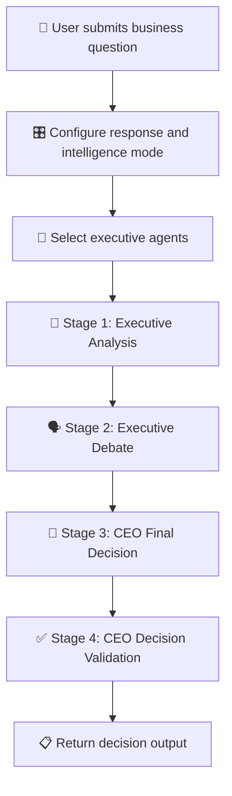
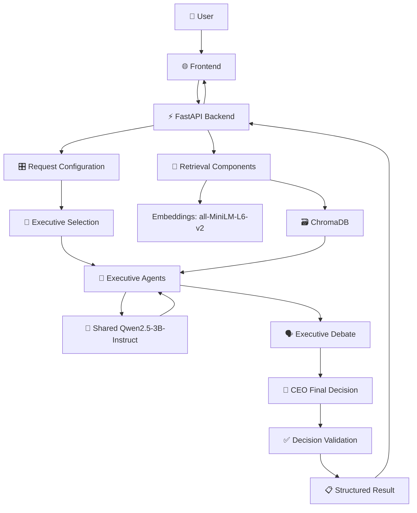

# 🏛️ AI Boardroom OS
### Where AI Agents Think Together

<p align="center">
  <strong>A Multi-Agent AI Business Decision Simulator</strong><br>
  Analyze business challenges through specialized AI executives, collaborative reasoning, and structured decision-making.
</p>

<p align="center">
  <a href="https://ai-boardroom-xexp.onrender.com">
    
  </a>
  <a href="https://github.com/krushnakodgirwar/AI-Boardroom">
    
  </a>
</p>

<p align="center">
  
  
  
  
  
  
</p>

---

## 🌐 Live Application

<p align="center">
  <a href="https://ai-boardroom-xexp.onrender.com">
    
  </a>
</p>

🔗 **Live Website:** https://ai-boardroom-xexp.onrender.com

🔗 **GitHub Repository:** https://github.com/krushnakodgirwar/AI-Boardroom

> **Deployment note:** The frontend is hosted on Render. Full AI analysis requires the FastAPI backend to be running and the frontend to be configured with a reachable backend URL.

---

# 📑 Table of Contents

<details>
<summary><strong>📖 Explore the README sections</strong></summary>

- [✨ Introduction](#-introduction)
- [🎯 Problem Statement](#-problem-statement)
- [💡 Project Vision](#-project-vision)
- [🚀 Key Features](#-key-features)
- [👥 The Executive Board](#-the-executive-board)
- [⚡ Intelligence Modes](#-intelligence-modes)
- [🎛️ Agent Selection](#️-agent-selection)
- [📋 Response Formats](#-response-formats)
- [🧠 AI Decision Workflow](#-ai-decision-workflow)
- [🏗️ System Architecture](#️-system-architecture)
- [🛠️ Technology Stack](#️-technology-stack)
- [📂 Project Structure](#-project-structure)
- [⚙️ Installation](#️-installation)
- [▶️ Run Locally](#️-run-locally)
- [🔌 API Documentation](#-api-documentation)
- [☁️ Deployment](#️-deployment)
- [🧪 Example Scenario](#-example-scenario)
- [⚠️ Limitations](#️-limitations)
- [🔮 Future Improvements](#-future-improvements)
- [👨‍💻 Author](#-author)

</details>

---

# ✨ Introduction

**AI Boardroom OS** is a multi-agent AI business decision simulator that explores how specialized AI executives can analyze a business challenge from different professional perspectives.

Rather than relying only on one general-purpose AI response, the system is designed around an executive boardroom workflow.

The backend uses a language model to generate executive analyses, supports agent selection, and can produce a structured CEO-level decision.

The project combines:

- 🤖 Specialized executive AI agents
- 🧠 LLM-powered analysis
- ⚡ Fast and deep analysis modes
- 👤 Manual and automatic agent selection
- 🗣️ Executive debate workflow
- 🏛️ CEO decision generation
- ✅ Decision consistency validation
- 🔎 Retrieval-related components using embeddings and ChromaDB
- 🌐 A web-based boardroom interface

## 💡 Core Idea

> Multiple AI perspectives → Structured analysis → Executive decision support

---

# 🎯 Problem Statement

Business decisions often involve several interconnected areas:

- Financial feasibility
- Technical feasibility
- Product-market fit
- Operational readiness
- Customer acquisition
- Legal and regulatory considerations
- Risk and uncertainty
- Organizational impact

A single response may not clearly separate these perspectives.

AI Boardroom explores a structured way to organize business analysis through specialized executive roles and a decision-making workflow.

---

# 💡 Project Vision

To build an interactive AI environment where users can submit a business challenge and explore it through a simulated executive board.

The system is designed to help users:

| Objective | Description |
|---|---|
| 🧠 Analyze | Examine a question from relevant executive perspectives |
| 🔍 Identify gaps | Surface risks and missing information |
| ⚖️ Compare | Review different considerations and potential disagreements |
| 📋 Structure | Organize analysis into readable reports |
| 🏛️ Decide | Generate a CEO-level decision output |

**Important:** AI-generated outputs are decision-support material, not a substitute for professional, legal, financial, or technical review.

---

# 🚀 Key Features

## 🤖 1. Multi-Agent Executive System

The project uses specialized executive roles to examine business problems from different perspectives.

Each selected agent can produce an analysis aligned with its assigned responsibility.

## ⚡ 2. Fast Intelligence

A faster analysis mode designed to obtain insights from relevant executives without requiring the full deep-analysis workflow.

## 🎯 3. Deep Boardroom Analysis

A deeper workflow designed around collaboration between executive agents, including executive analysis, debate, and a CEO-level final decision.

## 👥 4. Automatic Agent Selection

The system can automatically select executives considered relevant to the submitted question.

## 🎛️ 5. Manual Agent Selection

Users can choose which executives should participate.

The interface includes:

- Individual executive selection
- Select All
- Clear All

## 📋 6. Multiple Response Formats

The interface supports different response presentation options:

- Short Insight
- Executive Summary
- Detailed Analysis

These control the intended level of detail in the response.

## 🏛️ 7. CEO-Level Decision

The backend workflow includes a CEO final-decision stage that uses the executive analyses and available evidence.

## ✅ 8. Decision Validation

The system includes a decision-validation stage that checks the generated CEO decision for consistency with expected decision categories.

## 🔎 9. Retrieval Components

The backend initializes:

- `all-MiniLM-L6-v2` for embeddings
- ChromaDB for document storage and retrieval-related functionality

The actual evidence available to an analysis depends on the configured retrieval pipeline and supplied context.

## 🌐 10. Web Interface

The project includes a web-based frontend with boardroom configuration, executive selection, analysis progress, and output presentation.

---

# 👥 The Executive Board

The project includes executive roles such as the following.

| Executive | Responsibility |
|---|---|
| 👑 CEO | Final decision-making and executive synthesis |
| 💰 CFO | Financial feasibility, costs, revenue, and financial risk |
| 💻 CTO | Technical feasibility, architecture, and engineering considerations |
| 📣 CMO | Marketing, positioning, and market communication |
| ⚙️ COO | Operations, execution, and resource planning |
| 🎯 CSO | Business strategy and strategic direction |
| 📦 CPO | Product requirements, customer needs, and product strategy |
| ⚖️ Legal | Legal and regulatory considerations |
| 🛡️ Risk Officer | Risk identification and uncertainty |
| 👥 CHRO | People, workforce, and organizational considerations |
| 📈 CRO | Revenue generation and commercial growth |

> The interface design and project materials refer to a 10+ executive board. The precise active roster and which roles are independently instantiated depend on the backend configuration. The CEO also appears as the final decision stage in the workflow.

---

# ⚡ Intelligence Modes

The frontend provides two intelligence modes.

## ⚡ Fast Intelligence

Designed for rapid insights from relevant executives.

```text
Business Question
       ↓
Executive Selection
       ↓
Selected Executive Analysis
       ↓
Structured Output
```

The backend's fast-agent prompt specifies an assessment, key evidence, risks, missing information, recommendation, and confidence.

## 🎯 Deep Boardroom Analysis

Designed for a more extensive executive workflow.

```text
Business Question
       ↓
Executive Selection
       ↓
Executive Analysis
       ↓
Executive Debate
       ↓
CEO Final Decision
       ↓
Decision Validation
       ↓
Validated Decision
```

The exact execution behavior depends on the selected agents, analysis mode, and backend implementation.

---

# 🎛️ Agent Selection

Users can choose between automatic and manual executive selection.

## 🤖 Automatic Selection

The backend selects executives based on the submitted business question and its selection logic.

The system records selection information such as the selected executives, selection method, and confidence.

## 👤 Manual Selection

Users choose the executive agents themselves.

The interface provides:

- Select individual agents
- Select All
- Clear All
- Activate Boardroom

The backend logs show that manual selection can pass selected agent identifiers into the analysis workflow.

---

# 📋 Response Formats

The interface provides three response-detail options.

| Format | Intended use |
|---|---|
| ⚡ Short Insight | Concise output |
| 📋 Executive Summary | Condensed overview |
| 📚 Detailed Analysis | More extensive output |

The response format is separate from the intelligence mode: one concerns output detail, while the other concerns the analysis workflow.

---

# 🧠 AI Decision Workflow

The backend logs show a staged decision process.



## Stage 1 — Executive Analysis

Selected executives analyze the question from their assigned perspectives.

The backend supports parallel execution of executive analyses, with logs showing a concurrency limit.

## Stage 2 — Executive Debate

The workflow can process executive debate.

When only one executive is selected, the logs show that redundant debate generation is skipped because no cross-executive disagreement can be established.

## Stage 3 — CEO Final Decision

The CEO stage generates a final decision using the available executive analyses and evidence.

## Stage 4 — CEO Decision Validation

The backend checks the generated decision for consistency.

The logs show checks involving decision categories such as:

- Gather more information
- Pilot
- Immediate launch
- Conditional decision

The final output can include a decision, explanation, and next step.

---

# 🏗️ System Architecture



---

# 🛠️ Technology Stack

| Layer | Technology |
|---|---|
| 🌐 Frontend | HTML, CSS, JavaScript |
| ⚡ Backend API | FastAPI |
| 🚀 Server | Uvicorn |
| 🧠 Language model | Qwen2.5-3B-Instruct |
| 🧮 Quantization | 4-bit NF4 configuration |
| 🔥 ML framework | PyTorch |
| 🔎 Embeddings | all-MiniLM-L6-v2 |
| 🗃️ Vector database | ChromaDB |
| ☁️ Frontend deployment | Render |
| 🔗 Local backend exposure | Cloudflare Tunnel |

---

# 📂 Project Structure

The following is a high-level representation based on the project files discussed previously.

```text
AI-Boardroom/
│
├── frontend/
│   ├── index.html
│   ├── boardroom.html
│   └── ...
│
├── backend/
│   └── app/
│       ├── main.py
│       ├── api/
│       │   └── routes.py
│       └── ...
│
├── tests/
│   └── test_debate.py
│
├── requirements.txt
├── .gitignore
└── README.md
```

> This is not a verified complete file tree. Update it if your current repository contains additional modules, configuration files, or directories.

---

# ⚙️ Installation

## 1️⃣ Clone the repository

```bash
git clone https://github.com/krushnakodgirwar/AI-Boardroom.git
```

## 2️⃣ Navigate to the project directory

```bash
cd AI-Boardroom
```

## 3️⃣ Create a virtual environment

### Windows

```bash
python -m venv venv
venv\Scripts\activate
```

### macOS / Linux

```bash
python3 -m venv venv
source venv/bin/activate
```

## 4️⃣ Install dependencies

```bash
pip install -r requirements.txt
```

> ⚠️ The project uses a local language model and GPU-related components. Python, PyTorch, CUDA, and quantization dependencies must be compatible with your environment.

---

# ▶️ Run Locally

## 🖥️ Start the backend

From the repository root:

```bash
python -m uvicorn backend.app.main:app --host 0.0.0.0 --port 8000
```

If initialization succeeds, the API should be available at:

| Service | Address |
|---|---|
| Backend root | http://localhost:8000 |
| Health check | http://localhost:8000/health |
| FastAPI docs | http://localhost:8000/docs |

## 🌐 Open the frontend

Open the frontend entry page in your browser, or use the deployed application:

👉 https://ai-boardroom-xexp.onrender.com

Ensure the frontend API base URL points to the backend you intend to use.

---

# 🔌 API Documentation

The backend is built with FastAPI.

## Known routes

| Route | Purpose |
|---|---|
| `GET /` | Backend root |
| `GET /health` | Health check |
| `POST /boardroom/analyze` | Boardroom analysis |
| `/docs` | Interactive API documentation |

The `/boardroom/analyze` route is referenced in the project's backend logs.

### Example request concept

The backend accepts a business question and configuration such as the selected analysis mode, response detail, and agent-selection mode.

The exact JSON schema should be taken from the current FastAPI `/docs` page. The request fields and response structure can change as the backend evolves.

---

# ☁️ Deployment

## 🌍 Frontend — Render

The frontend is deployed at:

🔗 https://ai-boardroom-xexp.onrender.com

The frontend can be hosted as a static site independently of the local AI model.

## 🧠 Backend — Local Development

The backend has been run locally using Uvicorn, with Qwen2.5-3B-Instruct configured for GPU inference.

## 🔗 Cloudflare Tunnel

Cloudflare Tunnel can expose a local backend through a public HTTPS URL.

Start the backend first, then run:

```bash
cloudflared tunnel --url http://localhost:8000
```

Cloudflare will provide a temporary public URL. Configure the frontend to use that URL when connecting to your local API.

<details>
<summary><strong>⚠️ Important deployment considerations</strong></summary>

- The local backend must remain running.
- The Cloudflare tunnel must remain active.
- A temporary tunnel URL can change after restarting the tunnel.
- Cloudflare Tunnel forwards requests; it does not host the AI model.
- Do not place private API keys in frontend JavaScript.
- Avoid exposing sensitive development endpoints publicly.
- Stable production deployment requires a backend environment with suitable memory, compute, and model-serving resources.

</details>

---

# 🧪 Example Scenario

A user wants to evaluate whether a small SaaS company should launch a new project-management product.

Example information:

- Available investment budget: ₹20 lakh
- Estimated development cost: ₹8 lakh
- Estimated annual infrastructure cost: ₹2 lakh
- Engineering team: 3 developers
- Existing customer base: 2,000 users
- Proposed subscription price: ₹999 per month
- No customer demand survey completed
- No competitor analysis completed
- No technical prototype tested

The boardroom can be configured to analyze this scenario through selected executives.

Potential perspectives include:

| Agent | Analysis focus |
|---|---|
| CFO | Budget, costs, revenue assumptions, financial uncertainty |
| CTO | Prototype, engineering resources, technical feasibility |
| Risk Officer | Unknowns, risks, and missing validation |
| CEO | Synthesis and next-step decision |

The project's test logs demonstrate this type of multi-executive analysis and a CEO decision-validation stage.

> This is an illustrative project test scenario, not a verified real-world business recommendation.

---

# ⚠️ Limitations

- AI-generated analysis may contain errors or incomplete assumptions.
- Results depend on the quality of the user-provided information.
- A local model requires sufficient compute and memory.
- Full AI functionality depends on backend availability and frontend connectivity.
- Automatic agent selection depends on the implemented selection logic.
- Retrieval quality depends on the available documents and configured retrieval pipeline.
- Decision validation checks consistency against implemented rules; it does not prove that a business decision is correct.
- The system should not be treated as a replacement for professional judgment.

---

# 🔮 Future Improvements

- ☁️ Stable backend hosting
- 🔐 Authentication and access controls
- 📊 Richer analysis and comparison dashboards
- 📑 Exportable executive reports
- 🧠 More configurable language models
- 🔎 Improved evidence retrieval and source visibility
- 📈 Evaluation of agent output quality
- 🗂️ Persistent analysis history
- 🧪 Automated API and end-to-end tests
- ⚙️ More detailed configuration for agent workflows

---

# 🧪 Development & Testing

The project includes a debate test module referenced in prior development logs.

Run the test module from the project root:

```bash
python -m tests.test_debate
```

The test output previously showed:

- Shared Qwen model initialization
- Selected executive agents
- Executive analyses
- Debate handling
- CEO final decision
- Decision validation

Actual test results depend on the current code, dependencies, model availability, and hardware.

---

# 👨‍💻 Author

<p align="center">
  <strong>Krushna Kodgirwar</strong><br>
  B.Tech Computer Science Engineering<br>
  Vishwakarma Institute of Technology (VIT), Pune
</p>

<p align="center">
  <a href="https://github.com/krushnakodgirwar">
    
  </a>
</p>

---

<p align="center">
  <strong>🏛️ AI Boardroom OS</strong><br>
  <em>Multiple perspectives. Structured intelligence. Better-informed decisions.</em>
</p>

<p align="center">
  <a href="https://ai-boardroom-xexp.onrender.com">🚀 Launch Live Application</a>
  &nbsp;·&nbsp;
  <a href="https://github.com/krushnakodgirwar/AI-Boardroom">⭐ Explore GitHub Repository</a>
</p>
